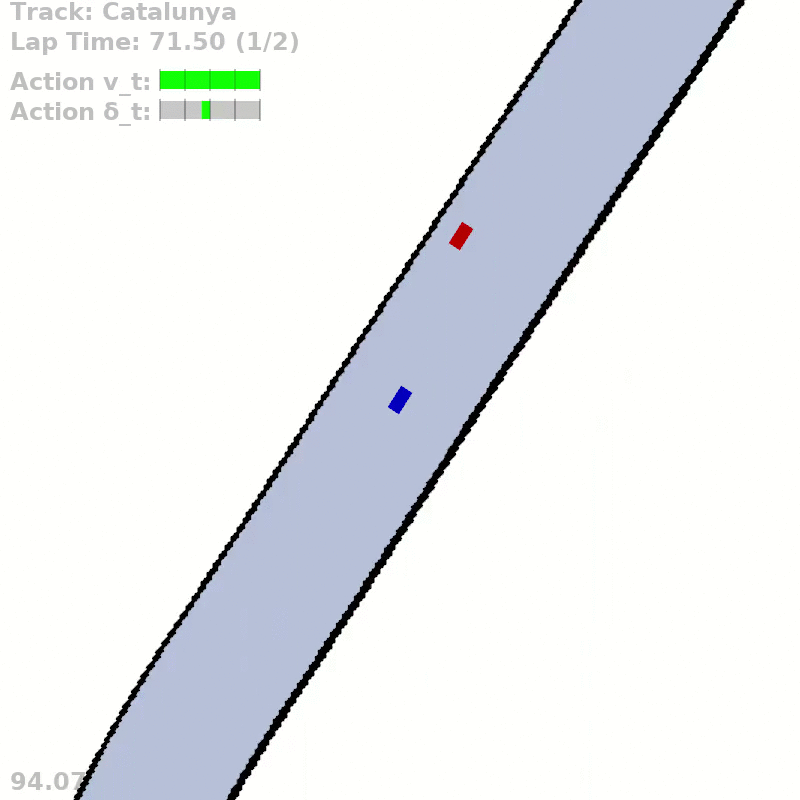
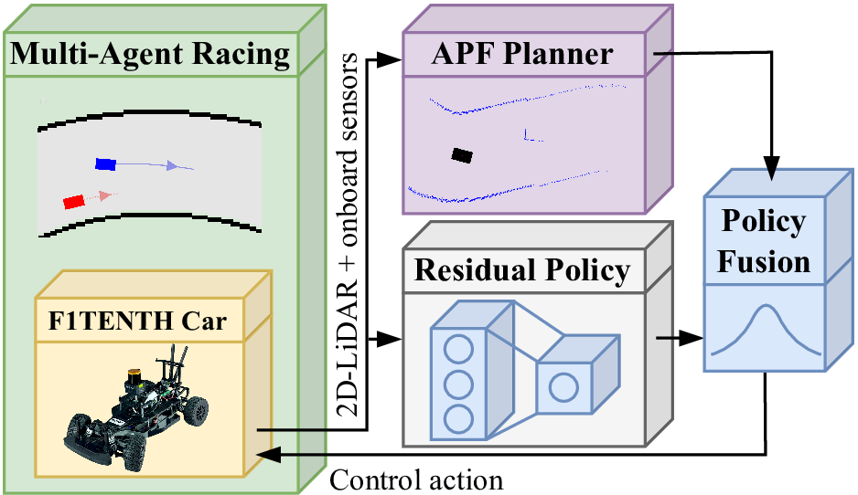

# RaceMOP

[](https://github.com/RichardLitt/standard-readme)

This repository is the official implementation of the [paper](https://scholar.google.com/citations?view_op=view_citation&hl=de&user=2ttMbLQAAAAJ&citation_for_view=2ttMbLQAAAAJ:WF5omc3nYNoC):

> **RaceMOP: Mapless Online Path Planning for Multi-Agent Autonomous Racing using Residual Policy Learning**
>
> [Trumpp, Raphael](https://scholar.google.com/citations?user=2ttMbLQAAAAJ&hl=en), 
> [Ehsan Javanmardi](https://scholar.google.com/citations?user=7kusI58AAAAJ&hl=en&oi=ao),
> [Jin Nakazato](https://scholar.google.com/citations?user=7Y1CFxMAAAAJ&hl=en),
> [Manabu Tsukada](https://scholar.google.com/citations?user=GSfYxPIAAAAJ&hl=en),
> and [Marco Caccamo](https://scholar.google.com/citations?user=Jbo1MqwAAAAJ&hl=en&oi=ao).

The paper is under review for possible publication. If you find our work useful, please consider [citing](#reference) it.

**Note**: The <u>full code</u> will be made available <u>after publication</u>.

<p align="center">
  
  
  
</p>


## Table of contents
- [Background](#background)
- [Install](#install)
- [Usage](#usage)
- [Reference](#reference)
- [License](#license)

## Background
The interactive decision-making in multi-agent autonomous racing offers insights valuable beyond the domain of self-driving cars.
Mapless online path planning is particularly of practical appeal but poses a challenge for safely overtaking opponents due to the limited planning horizon.
Accordingly, this paper introduces RaceMOP, a novel method for mapless online path planning designed for multi-agent racing of F1TENTH cars.
Unlike classical planners that depend on predefined racing lines, RaceMOP operates without a map, relying solely on local observations to overtake other race cars at high speed.
Our approach combines an artificial potential field method as a base policy with residual policy learning to introduce long-horizon planning capabilities.
We advance the field by introducing a novel approach for policy fusion with the residual policy directly in probability space.
Our experiments for twelve simulated racetracks validate that RaceMOP is capable of long-horizon decision-making with robust collision avoidance during overtaking maneuvers.
RaceMOP demonstrates superior handling over existing mapless planners while generalizing to unknown racetracks, paving the way for further use of our method in robotics.

<p align="center">
  
</p>

## Install
- We recommend to use a virtual environment for the installation:
  ```bash
  python -m venv racemop_env
  source racemop_env/bin/activate
  ```
- Activate the environment and install the following packages:
    ```bash
  pip install torch torchvision torchaudio
  pip install tensordict torchrl
  pip install torchinfo
  pip install matplotlib
  pip install gymnasium
  pip install hydra-core
  pip install tqdm
  pip install flatdict
  pip install wandb
  pip install numba
  pip install cvxpy
  pip install pyclothoids
  pip install --upgrade "jax[cpu]"
  pip install tensorboard
  pip install scikit-learn
  pip install pandas
  pip install termcolor
  pip install pyglet==1.5
    ```
- The simulator should be installed as a module:
    ```bash
  pip install -e simulator/
    ```
## Usage
### Inference
You can start evaluation the provided agent by running the following command:
```bash
python main.py
```
The use of your GPU can be avoided by running:
```bash
python main.py cuda=cpu
```
### Rendering
Rendering can be enabled by setting running:
```bash
python main.py render=True
```
Since this will launch windows for all 12 maps, we recommend selecting a specific map for evaluation:
```bash
python main.py render=True maps.maps_train=[Catalunya] maps.maps_test=[]
```

### Others
The baseline controller can be evaluated by running:
```bash
python main.py mode=baseline
```

### Docstrings
Most of the code is documented with *automatically* generated docstrings, please use them with caution.

## Reference
If you find our work useful, please consider citing our paper:

```bibtex 
@article{trumpp2024racemop,
  title={RaceMOP: Mapless online path planning for multi-agent autonomous racing using residual policy learning},
  author={Trumpp, Raphael and Javanmardi, Ehsan and Nakazato, Jin and Tsukada, Manabu and Caccamo, Marco},
  journal={arXiv preprint arXiv:2403.07129},
  year={2024}
}
```

## License
[GNU General Public License v3.0 only" (GPL-3.0)](LICENSE.txt) © [raphajaner](https://github.com/raphajaner)
